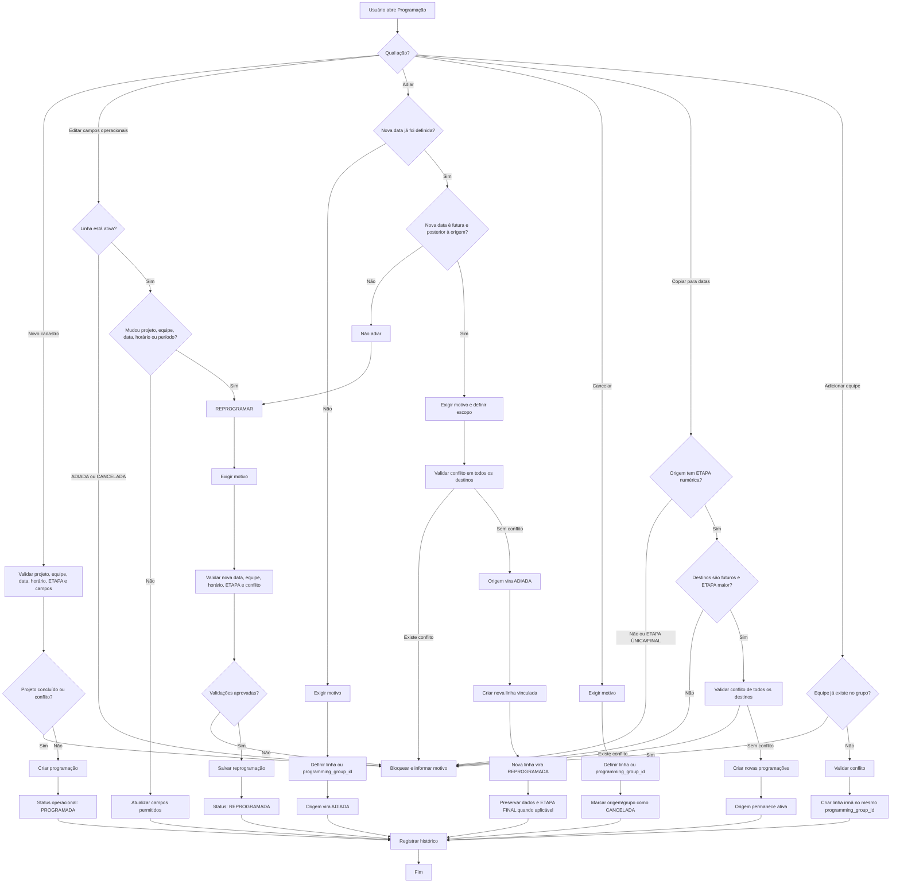
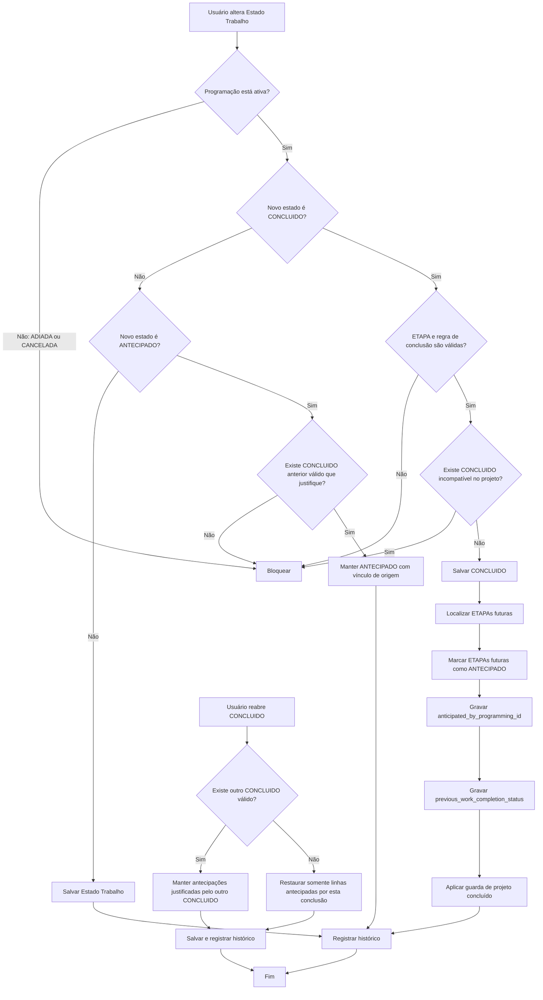

# Fluxograma de Regra de Negócio — Tela de Programação

## 1. Camadas de status

A programação possui duas camadas independentes:

### Status operacional da programação

* `PROGRAMADA`
* `REPROGRAMADA`
* `ADIADA`
* `CANCELADA`

### Estado Trabalho

* Estado normal/não concluído conforme catálogo
* `CONCLUIDO`
* `ANTECIPADO`

O Status operacional informa o que aconteceu com a agenda.

O Estado Trabalho informa a situação da execução do serviço.

---

# 2. Fluxo inicial comum a qualquer ação

**Início**
→ Usuário abre a tela de Programação
→ Seleciona projeto, data, equipe, horários, ETAPA e demais campos
→ Sistema identifica se é cadastro, edição, adiamento, cancelamento, cópia, adição de equipe ou atualização de Estado Trabalho.

Antes de salvar qualquer ação, validar:

→ Usuário possui permissão para a ação?

* Não → bloquear.
* Sim → continuar.

→ Projeto pertence ao tenant ativo?

* Não → bloquear.
* Sim → continuar.

→ Equipe, catálogos e programação pertencem ao tenant ativo?

* Não → bloquear.
* Sim → continuar.

→ Projeto está `CONCLUIDO`?

* Sim → bloquear cadastro, edição, adiamento, cancelamento, cópia e adição de equipe.
* Não → continuar.

→ Linha está `ADIADA` ou `CANCELADA`?

* Sim → bloquear edição direta.
* Não → continuar.

→ Dados obrigatórios estão preenchidos?

* Não → bloquear e informar os campos pendentes.
* Sim → continuar.

→ ETAPA está válida?

* Não → bloquear.
* Sim → continuar.

Regras de ETAPA:

* ETAPA numérica deve ser maior que zero.
* Não pode existir ETAPA numérica junto com `ETAPA ÚNICA`.
* Não pode existir ETAPA numérica junto com `ETAPA FINAL`.
* `ETAPA ÚNICA` e `ETAPA FINAL` não podem coexistir.
* Conflitos de ETAPA precisam ser validados por projeto, equipe, data e grupo aplicável.

→ Horários são válidos?

* Não → bloquear.
* Sim → continuar.

→ Existe conflito de agenda para equipe, data e horário?

* Sim → bloquear e informar conflito.
* Não → continuar.

→ Registro foi alterado por outro usuário desde que a tela foi aberta?

* Sim → bloquear, pedir recarga e não gravar alteração parcial.
* Não → executar a ação.

---

# 3. Decisão principal: qual ação o usuário está realizando?

## A. Não existe programação anterior

→ Usuário está criando uma programação nova.

### Ação: PROGRAMAR

→ Validar projeto, equipe, data, horário, ETAPA, campos obrigatórios e conflitos.
→ Criar uma linha para cada equipe informada.
→ Status operacional inicial = `PROGRAMADA`.
→ Registrar histórico de criação.
→ Fim.

---

## B. Existe programação ativa e o usuário alterou apenas campos operacionais

Exemplos:

* corrigir observação;
* alterar algum campo de SGD;
* alterar ponto elétrico;
* ajustar Nº EQ;
* atualizar campos que não alteram data, equipe, horário, período ou projeto.

### Ação: EDITAR

→ Linha precisa estar ativa, ou seja, não pode estar `ADIADA` nem `CANCELADA`.
→ Validar dados e conflitos aplicáveis.
→ Salvar atualização.
→ Manter o status operacional existente.

Regras importantes:

* Alguns campos operacionais podem sincronizar com outras equipes do mesmo `programming_group_id`.
* A alteração de ETAPA é individual da linha; não deve ser propagada automaticamente para todas as equipes do grupo.
* Registrar histórico como `UPDATE`.

→ Fim.

---

## C. Existe programação ativa e mudou projeto, equipe, data, horário ou período

Exemplos:

* programação era dia 10 e precisa ir para o dia 15;
* programação era para a Equipe 01 e precisa ir para a Equipe 03;
* horário mudou;
* período mudou;
* projeto mudou;
* data já chegou ou passou e a programação precisa ser refeita.

### Ação: REPROGRAMAR

→ Exigir motivo da reprogramação.
→ Validar nova data, equipe, horário, ETAPA e conflitos.
→ Registrar alteração como reprogramação.
→ Status operacional do registro ativo passa a ser ou permanece `REPROGRAMADA`.
→ Registrar histórico como `RESCHEDULE`.

### Regra principal

Use **REPROGRAMAR** quando a programação precisa ser refeita ou ajustada e não se enquadra como simples adiamento.

Especialmente:

* quando a data original já chegou;
* quando a data original já passou;
* quando for necessário mover a programação para trás;
* quando houver mudança de equipe;
* quando houver mudança de horário;
* quando houver mudança de período;
* quando houver mudança de projeto;
* quando o usuário não quer apenas “empurrar para frente”, mas redefinir a programação.

→ Fim.

---

## D. A programação ainda está ativa e só será empurrada para frente

Pergunta:

→ A programação não será cancelada, apenas ocorrerá em uma nova data futura?

* Não → avaliar Cancelar ou Reprogramar.
* Sim → seguir para Adiar.

### Ação: ADIAR SEM NOVA DATA

Use quando:

* a programação não será executada na data atual;
* ainda não existe uma nova data definida;
* é necessário retirar a linha da agenda ativa e preservar o motivo.

Fluxo:

→ Exigir motivo.
→ Definir escopo: somente a linha ou todo o grupo operacional.
→ Marcar origem como `ADIADA`.
→ Registrar histórico como `ADIADA`.
→ Não criar nova programação.
→ Fim.

---

### Ação: ADIAR COM NOVA DATA

Use quando:

* a programação ainda será executada;
* a nova data já está definida;
* a nova data é futura;
* a nova data é posterior à origem;
* o objetivo é somente postergar a execução.

Fluxo:

→ Exigir motivo.
→ Validar nova data.
→ Nova data é igual ou anterior à origem?

* Sim → bloquear adiamento. Usar Reprogramar quando a necessidade for redefinir a programação.
* Não → continuar.

→ Validar conflito da nova data, equipe e horário.

* Existe conflito → bloquear toda a operação. Nenhuma origem pode ficar adiada sem que a nova programação seja criada.
* Não existe conflito → continuar.

→ Marcar programação original como `ADIADA`.
→ Criar nova programação vinculada à origem.
→ Nova linha recebe status operacional `REPROGRAMADA`.
→ Preservar os dados operacionais aplicáveis.
→ Preservar `ETAPA FINAL`, quando existir na origem.
→ Registrar motivo, origem, destino, usuário e histórico.
→ Fim.

### Regra prática

```text
Data futura foi apenas postergada?
→ ADIAR

Data já chegou/passou ou a mudança altera o planejamento de forma ampla?
→ REPROGRAMAR
```

---

## E. A programação não será mais executada

Pergunta:

→ O serviço deixa de existir nesta programação e não haverá nova data vinculada agora?

* Sim → Cancelar.
* Não → Adiar ou Reprogramar.

### Ação: CANCELAR

→ Exigir motivo.
→ Definir escopo: linha individual ou grupo operacional.
→ Validar concorrência.
→ Marcar linha ou grupo como `CANCELADA`.
→ Não criar nova linha.
→ Registrar histórico como `CANCELADA`.
→ Fim.

### Regra prática

```text
O serviço ainda vai acontecer?
Sim → Adiar ou Reprogramar.

O serviço não vai mais acontecer neste planejamento?
Não → Cancelar.
```

---

# 4. Escopo da ação: linha individual ou grupo operacional

Antes de Adiar ou Cancelar:

→ Usuário escolheu agir apenas na linha?

* Sim → afetar somente a programação selecionada.
* Não → verificar se a ação será aplicada ao grupo operacional.

O grupo é identificado por:

```text
programming_group_id
```

Regras:

* Não cancelar ou adiar automaticamente todas as linhas do mesmo projeto e mesma data.
* Se existirem ETAPAs diferentes para o mesmo projeto e data, a ação deve atingir somente o grupo da linha escolhida.
* Em adiamento de grupo, se houver conflito em uma única equipe, toda a operação deve falhar.
* Não pode existir adiamento parcial: ou todas as origens são adiadas e todos os destinos criados, ou nada é salvo.

---

# 5. Copiar programação não é reprogramar

## Ação: COPIAR PARA DATAS

Use quando:

* a programação original continua existindo;
* deseja-se gerar novas programações adicionais;
* a origem possui ETAPA numérica;
* os destinos representam etapas posteriores.

Fluxo:

→ Origem possui ETAPA numérica?

* Não → bloquear.

→ Origem é `ETAPA ÚNICA` ou `ETAPA FINAL`?

* Sim → bloquear cópia.
* Não → continuar.

→ Data destino é posterior à data origem?

* Não → bloquear.
* Sim → continuar.

→ ETAPA destino é maior que a ETAPA origem?

* Não → bloquear.
* Sim → continuar.

→ Há conflito de agenda ou ETAPA em qualquer destino?

* Sim → bloquear todo o lote.
* Não → criar cópias.

→ Criar novas programações por data/equipe.
→ Manter origem ativa.
→ Registrar histórico como `COPY`.
→ Fim.

### Diferença entre copiar e reprogramar

```text
COPIAR
= origem permanece e novas programações são criadas.

REPROGRAMAR
= programação existente é alterada porque o plano mudou.

ADIAR
= origem deixa de ser ativa e é substituída por nova data futura.
```

---

# 6. Adicionar equipe não é reprogramar

## Ação: ADICIONAR EQUIPE

Use quando:

* a programação continua válida;
* é necessário incluir mais uma equipe na mesma execução/grupo.

Fluxo:

→ Linha de origem está ativa?

* Não → bloquear.

→ Projeto está concluído?

* Sim → bloquear.
* Não → continuar.

→ Equipe já existe no mesmo `programming_group_id`?

* Sim → bloquear.
* Não → continuar.

→ Validar conflito de agenda e ETAPA.
→ Criar linha irmã para a nova equipe.
→ Usar o mesmo `programming_group_id`.
→ Registrar a origem em `copied_from_programming_id`, quando aplicável.
→ Registrar histórico `ADD_TEAM`.
→ Fim.

---

# 7. Fluxo de Estado Trabalho

O Estado Trabalho não substitui o status operacional.

Exemplo:

```text
Status operacional: REPROGRAMADA
Estado Trabalho: CONCLUIDO
```

são informações diferentes.

## Salvar Estado Trabalho comum

→ Usuário altera apenas Estado Trabalho.
→ Validar se a programação está ativa.
→ Validar catálogo de Estado Trabalho.
→ Salvar novo Estado Trabalho.
→ Atualizar equipes vinculadas conforme a regra de sincronização aplicável.
→ Registrar histórico.
→ Fim.

---

## Salvar CONCLUIDO

→ Usuário seleciona `CONCLUIDO`.

→ A linha possui ETAPA numérica válida?

* Não → aplicar a regra específica permitida para ETAPA ÚNICA/FINAL ou bloquear conforme a validação vigente.
* Sim → continuar.

→ Existe outro `CONCLUIDO` incompatível para o projeto?

* Sim → bloquear.
* Não → continuar.

→ Salvar Estado Trabalho = `CONCLUIDO`.
→ Localizar ETAPAs futuras do mesmo projeto.
→ Marcar ETAPAs futuras como `ANTECIPADO`.
→ Registrar em cada antecipação:

* `anticipated_by_programming_id`;
* data/hora da antecipação;
* Estado Trabalho anterior.

→ Aplicar guarda de projeto concluído.
→ Bloquear novas ações operacionais enquanto o projeto estiver concluído.
→ Fim.

---

## Salvar ANTECIPADO

`ANTECIPADO` não deve ser selecionado manualmente.

Ele só pode existir quando:

→ houve um `CONCLUIDO` anterior válido;
→ a programação antecipada foi vinculada ao registro que gerou a antecipação.

Se não houver um `CONCLUIDO` válido que justifique o status:

→ bloquear gravação, edição, cópia ou tentativa de manter `ANTECIPADO`.

---

## Reabrir CONCLUIDO

→ Usuário altera `CONCLUIDO` para outro Estado Trabalho.

→ Existe outro `CONCLUIDO` válido mantendo a antecipação?

* Sim → manter as linhas `ANTECIPADO` vinculadas à outra conclusão válida.
* Não → restaurar somente as linhas antecipadas por esta conclusão.

→ Restaurar o Estado Trabalho anterior registrado em cada linha antecipada.
→ Limpar ou ajustar o vínculo de antecipação correspondente.
→ Reavaliar a guarda de projeto concluído.
→ Registrar histórico.
→ Fim.

---

# 8. Matriz de decisão rápida

| Situação                                                   | Ação correta                       | Resultado principal                      |
| ---------------------------------------------------------- | ---------------------------------- | ---------------------------------------- |
| Não existe programação anterior                            | Programar                          | Cria `PROGRAMADA`                        |
| Ajuste sem mudar projeto, equipe, data, horário ou período | Editar                             | Atualiza linha ativa                     |
| Mudou equipe, data, horário, período ou projeto            | Reprogramar                        | Salva motivo e usa `REPROGRAMADA`        |
| Data futura só foi empurrada para frente                   | Adiar com nova data                | Origem `ADIADA` + destino `REPROGRAMADA` |
| Nova data ainda não está definida                          | Adiar sem nova data                | Origem `ADIADA`                          |
| Data já chegou/passou e precisa ser refeita                | Reprogramar                        | Ajusta com motivo                        |
| Serviço não acontecerá mais                                | Cancelar                           | Linha/grupo `CANCELADA`                  |
| Precisa gerar novas datas e manter origem                  | Copiar                             | Cria novas linhas                        |
| Precisa apenas incluir outra equipe                        | Adicionar equipe                   | Cria linha irmã                          |
| Serviço foi concluído                                      | Salvar Estado Trabalho `CONCLUIDO` | Pode antecipar ETAPAs futuras            |
| ETAPA futura ficou antecipada por conclusão anterior       | `ANTECIPADO` automático            | Não pode ser manual                      |




