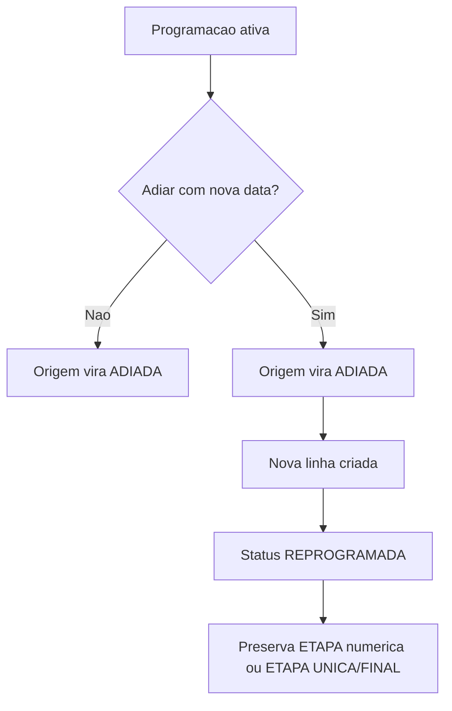
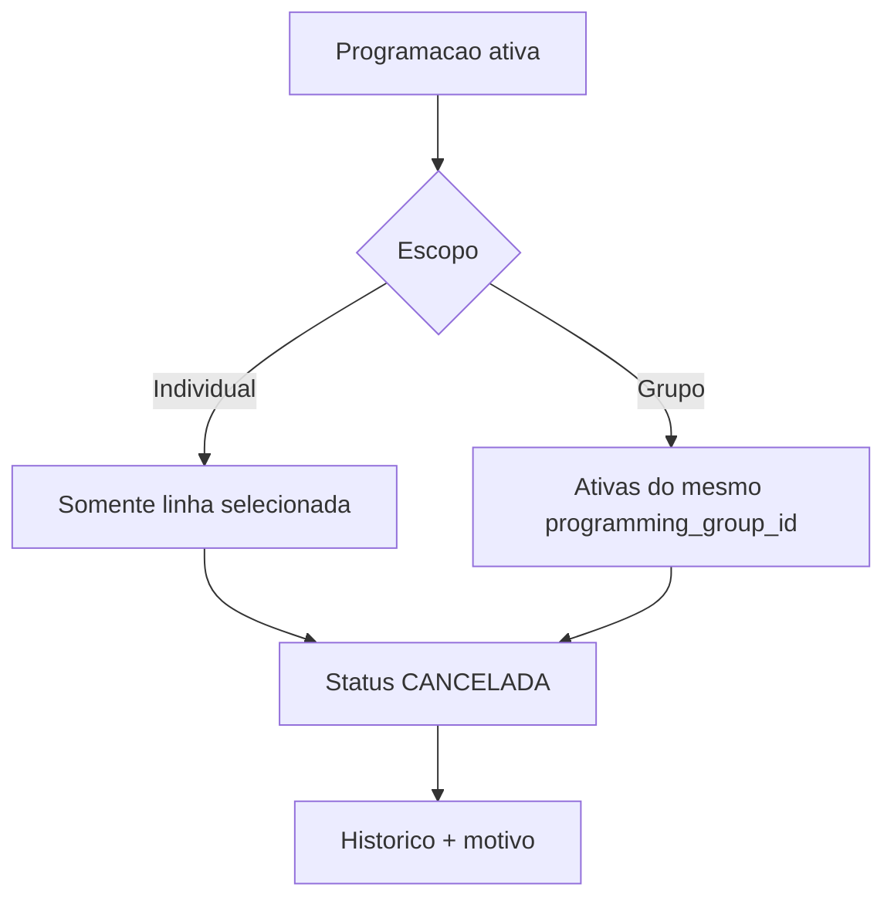
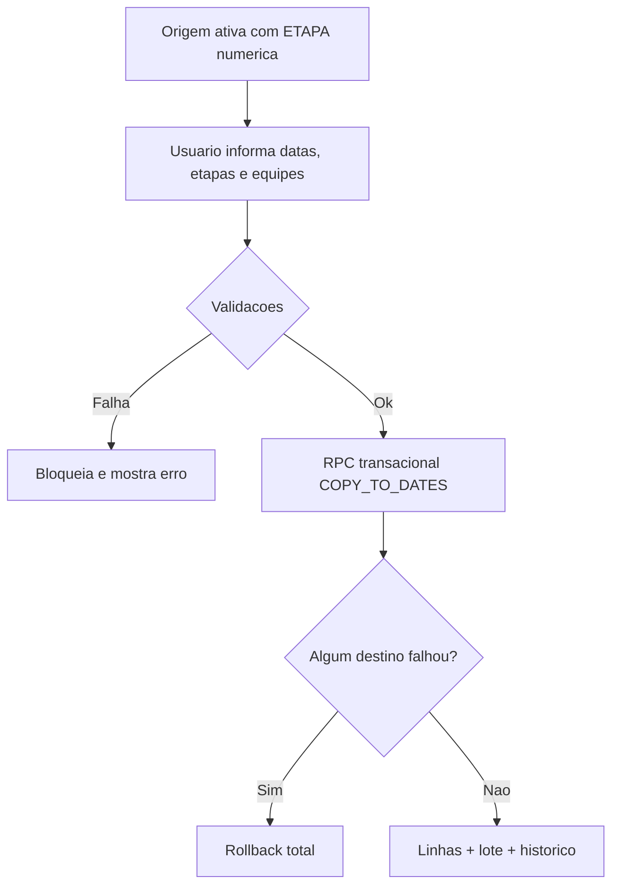

# Mapa de Regras de Negocio - Programacao

Documento gerado em 2026-06-26.

Escopo:
- Tela `Programacao` atual: `/programacao-simples`.
- Tela de consulta: `/programacao-visualizacao`, usando a mesma view em modo visualizacao.
- API principal: `/api/programacao`.
- Banco esperado com migrations ate `282_fix_completed_group_integrity_null_boolean.sql`.

---

## Resumo Executivo

A Programacao controla agendas operacionais por `tenant_id`, `project_id`, `team_id` e `execution_date`.

Regras centrais:
- Uma programacao ativa tem status operacional `PROGRAMADA` ou `REPROGRAMADA`.
- Uma programacao interrompida tem status `ADIADA` ou `CANCELADA`.
- Uma programacao encerrada por conclusao antecipada do projeto tem status `ANTECIPADA`.
- O grupo operacional e definido por `programming_group_id`.
- `programming_group_id` representa:
  - ETAPA numerica: mesmo `tenant_id + project_id + execution_date + etapa_number`.
  - ETAPA UNICA: mesmo `tenant_id + project_id + execution_date + etapa_unica`.
  - ETAPA FINAL: mesmo `tenant_id + project_id + execution_date + etapa_final`.
  - Sem etapa: grupo proprio por registro.
- `programming_group_id` e controlado pelo banco:
  - nao e informado pelo cliente;
  - nao pode ser alterado diretamente;
  - e calculado/recalculado por trigger quando Projeto, Data ou ETAPA mudam;
  - e preservado ao adicionar equipe no mesmo grupo;
  - e recriado quando uma programacao e copiada ou adiada para outra data.
- Toda programacao ativa deve estar em exatamente um estado de ETAPA:
  - `etapa_number > 0`, `etapa_unica = false`, `etapa_final = false`;
  - `etapa_number = null`, `etapa_unica = true`, `etapa_final = false`;
  - `etapa_number = null`, `etapa_unica = false`, `etapa_final = true`.
- Combinacoes como ETAPA 0, ETAPA negativa, ETAPA numerica com flag, `ETAPA UNICA + ETAPA FINAL` ou nenhuma ETAPA ativa sao bloqueadas no banco.
- `Estado Trabalho = CONCLUIDO` representa conclusao do projeto inteiro, independentemente da equipe/linha que registrou a conclusao.
- Um projeto pode ter no maximo uma programacao ativa com `Estado Trabalho = CONCLUIDO` por `tenant_id + project_id`.
- A guarda de grupo para `CONCLUIDO` deve agir somente quando a linha entra efetivamente em `CONCLUIDO` de forma canonica (texto ou UUID), ou quando uma linha `CONCLUIDO` passa a ficar ativa/em novo grupo. Edicoes operacionais comuns de uma linha que ja era `CONCLUIDO` no mesmo grupo nao devem ser bloqueadas.
- `Estado Trabalho = CONCLUIDO` bloqueia novas programacoes, copias, inclusao de equipe, adiamento e cancelamento ate reabrir o projeto por uma edicao/acao permitida.
- Ao salvar uma etapa como `CONCLUIDO`, etapas futuras ativas do mesmo projeto podem ser encerradas operacionalmente como `ANTECIPADA` com `Estado Trabalho = ANTECIPADO`.
- `ANTECIPADA` nao conta como programacao ativa, nao bloqueia agenda da equipe e nao deve aparecer como servico pendente.
- Ao retirar o unico `CONCLUIDO`, cada programacao `ANTECIPADO` vinculada a ele volta ao `previous_work_completion_status` e ao status operacional anterior.
- Se a base ainda tiver dado legado inconsistente com outro `CONCLUIDO` anterior valido, a reabertura pode reatribuir o `anticipated_by_programming_id`; isso e tolerancia de saneamento, nao fluxo operacional normal.
- Adiamento com nova data transforma a origem em `ADIADA` e cria nova linha `REPROGRAMADA`.
- Cancelamento transforma a linha, ou grupo escolhido, em `CANCELADA`.
- Copia para outras datas exige origem com ETAPA numerica e destino com ETAPA maior.
- As escritas sensiveis devem passar por API/RPC com `tenant_id` derivado da sessao.

---

## Entidades e Campos Principais

Tabela principal:
- `project_programming`

Campos de identidade:
- `tenant_id`: escopo multi-tenant obrigatorio.
- `project_id`: obra/projeto.
- `team_id`: equipe.
- `execution_date`: data de execucao.

Status operacional:
- `status`: `PROGRAMADA`, `REPROGRAMADA`, `ADIADA`, `CANCELADA`, `ANTECIPADA`.
- `is_active`: legado/apoio visual; a regra atual usa principalmente `status`.
- `cancellation_reason`: motivo de cancelamento/adiamento.
- `canceled_at`: data/hora da interrupcao.
- `canceled_by`: usuario que interrompeu.

Etapa:
- `etapa_number`: etapa numerica.
- `etapa_unica`: etapa especial unica.
- `etapa_final`: etapa especial final.

Estado Trabalho:
- `work_completion_status`: estado operacional da obra na programacao.
- Catalogo: `programming_work_completion_catalog`.
- `previous_operational_status`: status operacional anterior de uma linha encerrada como `ANTECIPADA`, usado para restaurar a agenda quando o `CONCLUIDO` for reaberto.

Rastreio:
- `project_programming_history`: historico operacional oficial da Programacao.
- `copied_from_programming_id`: origem usada em copia/adicao de equipe.
- `copy_batch_id`: lote de copia quando aplicavel.

Campos operacionais sincronizados por grupo operacional:
- `feeder`
- `campo_eletrico`
- `electrical_eq_catalog_id`
- `sgd_type_id`
- `affected_customers`
- `outage_start_time`
- `outage_end_time`
- `support`
- `support_item_id`
- `poste_qty`
- `estrutura_qty`
- `trafo_qty`
- `rede_qty`

Regra pratica de `programming_group_id`:

| Acao | Regra do grupo |
| --- | --- |
| Cadastro com varias equipes | Todas recebem o mesmo grupo quando compartilham Projeto + Data + classificacao de ETAPA |
| Adicionar equipe | Recebe o grupo da linha modelo |
| Copia para nova data/ETAPA | Cria novo grupo para cada combinacao Data + ETAPA |
| Adiamento individual com nova data | Cria novo grupo na linha `REPROGRAMADA` |
| Adiamento de grupo com nova data | Todas as novas linhas recebem o mesmo novo grupo quando compartilham Data + ETAPA |
| Editar Projeto, Data ou ETAPA | Recalcula o grupo |
| Cancelar ou adiar sem nova data | Mantem o grupo historico |

---

## Status Operacional

| Status | Significado | Acoes permitidas | Efeitos principais |
| --- | --- | --- | --- |
| `PROGRAMADA` | Agenda ativa original | Editar, copiar, adicionar equipe, adiar, cancelar | Aparece na lista/calendario como ativa. |
| `REPROGRAMADA` | Agenda ativa resultante de reprogramacao/adiamento/copia conforme fluxo | Editar, copiar, adicionar equipe, adiar, cancelar | Tambem conta como ativa. |
| `ADIADA` | Agenda interrompida por adiamento | Detalhes/historico; sem edicao operacional | Guarda motivo/data de interrupcao. Pode ter nova linha `REPROGRAMADA` vinculada. |
| `CANCELADA` | Agenda cancelada | Detalhes/historico; sem edicao operacional | Guarda motivo/data de cancelamento. |
| `ANTECIPADA` | Agenda encerrada porque o projeto foi concluido antes da data futura | Detalhes/historico; sem edicao operacional | Libera a equipe e mantem rastreio em `work_completion_status = ANTECIPADO`. |

Regra de atividade:
- Ativas: `PROGRAMADA`, `REPROGRAMADA`.
- Inativas/interrompidas: `ADIADA`, `CANCELADA`, `ANTECIPADA`.

---

## Fluxo Principal de Cadastro

1. Usuario seleciona projeto, data, periodo, horario, equipe(s), ETAPA, tipo de SGD, numero/tipo do N EQ e demais campos.
2. Frontend sugere automaticamente a proxima ETAPA apenas no cadastro novo, quando:
   - ha projeto;
   - ha data;
   - ha equipe selecionada;
   - nao esta em modo edicao;
   - nao marcou `ETAPA UNICA` nem `ETAPA FINAL`.
3. O usuario pode manter a sugestao ou editar manualmente.
4. Antes de salvar, o frontend valida campos obrigatorios, horario, documentos, quantidades, ETAPA e conflitos locais.
5. API repete validacoes criticas.
6. Backend salva via RPC full transacional.
7. Cada equipe selecionada gera uma programacao independente.
8. Historico e registrado em `project_programming_history`.

Campos obrigatorios no cadastro/edicao ativa:
- Projeto.
- Equipe(s).
- Data execucao.
- Periodo.
- Hora inicio.
- Hora termino.
- Tipo de SGD.
- N EQ - Numero.
- N EQ - Tipo.
- ETAPA numerica, exceto quando `ETAPA UNICA` ou `ETAPA FINAL` estiver marcada.

---

## Regra de ETAPA

### ETAPA Numerica

Regras:
- Deve ser inteiro maior que zero.
- E obrigatoria para programacao ativa quando `ETAPA UNICA` e `ETAPA FINAL` estao desmarcadas.
- Nao pode conflitar com historico do mesmo projeto/equipe.
- Nao pode ser igual ou menor do que etapa ja existente na validacao de conflito.
- Copia para outras datas exige destino com ETAPA maior que a origem.

Efeitos:
- Usada para ordenacao logica da obra.
- Usada na regra `CONCLUIDO -> ANTECIPADO`.
- Usada na validacao de copia e adicao de equipe.

### ETAPA UNICA

Regras:
- Mutuamente exclusiva com `ETAPA FINAL`.
- Nao usa `etapa_number`.
- Bloqueia a acao `Copiar programacao`.
- Deve ser preservada no adiamento.

Efeitos:
- Exportacoes exibem `ETAPA UNICA` no campo de informacao de etapa.
- A programacao continua valida mesmo com `etapa_number = null`.

### ETAPA FINAL

Regras:
- Mutuamente exclusiva com `ETAPA UNICA`.
- Nao usa `etapa_number`.
- Bloqueia a acao `Copiar programacao`.
- Deve ser preservada no adiamento.

Efeitos:
- Exportacoes exibem `ETAPA FINAL` no campo de informacao de etapa.
- A programacao continua valida mesmo com `etapa_number = null`.

### Guarda de Banco

Constraint/trigger:
- Nome logico atual do erro: `project_programming_active_stage_valid_check`
- Migration `269`: criou o CHECK imediato e fez backfill das programacoes ativas antigas sem etapa.
- Migration `270`: substitui o CHECK imediato por constraint trigger diferida.
- Migration `271`: ajusta a funcao diferida para validar a linha final persistida, nao o `NEW` antigo do evento enfileirado.
- Migration `275`: endurece a validacao diferida para exigir exatamente uma classificacao valida de ETAPA.
- Funcao: `enforce_project_programming_active_stage_required`
- Trigger atual: `project_programming_active_stage_valid_check`

Regra:
```sql
status not in ('PROGRAMADA', 'REPROGRAMADA')
or (
  etapa_number > 0
  and coalesce(etapa_unica, false) = false
  and coalesce(etapa_final, false) = false
)
or (
  etapa_number is null
  and coalesce(etapa_unica, false) = true
  and coalesce(etapa_final, false) = false
)
or (
  etapa_number is null
  and coalesce(etapa_unica, false) = false
  and coalesce(etapa_final, false) = true
)
```

Objetivo:
- Impedir novas programacoes ativas sem ETAPA valida ou com combinacao invalida de ETAPA, inclusive por escrita direta ou RPC.
- Validar a regra no fim da transacao para permitir que as RPCs full criem a linha base e preencham `etapa_number`, `etapa_unica` ou `etapa_final` antes do commit.

---

## Estado Trabalho

Campo:
- `project_programming.work_completion_status`

Catalogo:
- `programming_work_completion_catalog`

Valores relevantes no fluxo atual:
- `PARCIAL_PLANEJADO`
- `PARCIAL_NAO_PLANEJADO`
- `CONCLUIDO`
- `ANTECIPADO`
- `NAO_INFORMADO` apenas como filtro visual, nao como status salvo.

Valor legado:
- `PARCIAL` nao e codigo ativo nem valor salvo. Payload ou dado legado com `PARCIAL` e normalizado para `PARCIAL_NAO_PLANEJADO`.

### Cadastro/Copia/Adicao

Ao criar uma nova programacao:
1. Backend salva `work_completion_status = null`.
2. Nao existe preenchimento automatico por ultimo status do projeto.
3. Nao existe fallback automatico para `PARCIAL`.
4. O preenchimento de `Estado Trabalho` ocorre apenas por edicao/acao explicita do usuario.

Ao copiar ou adicionar equipe:
1. Se a linha modelo possui `work_completion_status`, o backend valida o codigo no catalogo ativo do tenant e copia esse valor.
2. Se a linha modelo nao possui `work_completion_status`, a nova linha tambem fica sem `Estado Trabalho`.
3. Fluxo normal nao copia projeto ja `CONCLUIDO`; portanto origem `ANTECIPADA`/`ANTECIPADO` fica bloqueada pela conclusao global.
4. A validacao transacional de `ANTECIPADO` permanece no banco apenas como protecao para dado legado, importacao administrativa ou correcao interna.

### Bloqueio por CONCLUIDO

Decisao funcional:
- `CONCLUIDO` e status de conclusao do projeto inteiro.
- Uma unica programacao marcada como `CONCLUIDO` trava novas operacoes desse projeto ate reabertura explicita.
- `CONCLUIDO` nao e propagado por sincronizacao operacional generica. Apenas a linha canonica recebe `CONCLUIDO`.
- A linha canonica so pode receber `CONCLUIDO` se nao existir outra programacao ativa no mesmo `programming_group_id`.
- A sincronizacao generica de Estado Trabalho usa `programming_group_id` e ignora estados finais (`CONCLUIDO` e `ANTECIPADO`).

Quando existe programacao do projeto com `Estado Trabalho = CONCLUIDO`:
- Bloqueia novo cadastro.
- Bloqueia copia para outras datas.
- Bloqueia adicionar equipe.
- Bloqueia adiar.
- Bloqueia cancelar.
- Permite edicao apenas quando a propria programacao concluida esta sendo editada para trocar o Estado Trabalho para valor diferente de `CONCLUIDO`.

Mensagem esperada:
- "Este projeto possui Estado Trabalho CONCLUIDO..."

### Salvar CONCLUIDO

Quando uma edicao salva `work_completion_status = CONCLUIDO` e a programacao tem `etapa_number`:
1. Programacao editada fica `CONCLUIDO`.
2. Banco bloqueia se houver outra linha ativa no mesmo `programming_group_id`.
3. Backend chama `mark_project_programming_future_stages_anticipated`.
4. Etapas futuras ativas do mesmo projeto, com `etapa_number` maior, podem receber `ANTECIPADO`.
5. Cada linha antecipada grava `anticipated_by_programming_id`, `anticipated_at` e `previous_work_completion_status`.
6. Historico operacional e registrado.

Restricoes de `ANTECIPADO`:
- Nao aparece no seletor manual de Estado Trabalho.
- Nao pode ser enviado por cadastro novo ou edicao livre.
- Exige `ETAPA` numerica.
- Exige `CONCLUIDO` anterior valido no mesmo tenant/projeto, com `etapa_number` menor.
- Copia/adicao de equipe que parte de uma linha `ANTECIPADO` deve preservar `ANTECIPADO` apenas quando encontrar novamente o `CONCLUIDO` anterior que justifica o estado, na mesma transacao.

### Reabrir CONCLUIDO

Quando o usuario troca uma programacao de `CONCLUIDO` para outro Estado Trabalho:
1. API valida que o novo status nao e concluido.
2. Salva via RPC transacional de Estado Trabalho.
3. Trigger de banco localiza linhas com `anticipated_by_programming_id` igual a programacao reaberta.
4. Para cada linha afetada, o banco procura outro `CONCLUIDO` anterior valido do mesmo tenant/projeto, com `etapa_number` menor.
5. Se encontrar, a linha continua `ANTECIPADO` e `anticipated_by_programming_id` passa para a conclusao anterior mais proxima.
6. Se nao encontrar, a linha volta para `previous_work_completion_status` e limpa `anticipated_by_programming_id`, `anticipated_at` e `previous_work_completion_status`.
7. Linhas antecipadas por outro `CONCLUIDO` nao sao alteradas.
8. Atualiza visualizacao da linha.

### Interrompidas e CONCLUIDO

Regras:
- Programacao `ADIADA` ou `CANCELADA` nao deve receber `Estado Trabalho = CONCLUIDO`.
- Banco possui trigger/guarda para impedir divergencia `ADIADA/CANCELADA + CONCLUIDO`.
- Tambem bloqueia nova transicao para `ADIADA`/`CANCELADA` quando o projeto ja possui `CONCLUIDO`.

---

## Reprogramacao por Edicao

Uma edicao vira reprogramacao quando muda ao menos um destes campos:
- Projeto.
- Equipe.
- Data.
- Hora inicio.
- Hora termino.
- Periodo.

Regras:
- Exige motivo de reprogramacao.
- Motivo precisa vir do catalogo `programming_reason_catalog`.
- Se o motivo exigir observacao, observacao complementar e obrigatoria.
- Motivo final precisa ter no minimo 10 caracteres quando enviado ao backend.
- Usa controle de concorrencia por `expectedUpdatedAt`.
- Nao permite editar programacao `ADIADA` ou `CANCELADA`.
- Se a programacao atual possui atividades incompletas no snapshot, o frontend e o backend bloqueiam o save.

Efeitos:
- Salva via RPC full.
- Historico registra alteracoes como `UPDATE` ou `RESCHEDULE`, conforme a RPC.
- Se a alteracao resultar em `CONCLUIDO`, dispara regra de `ANTECIPADO`.

---

## Adiamento

Acao:
- Botao `Adiar`.

Disponibilidade:
- Apenas programacoes ativas (`PROGRAMADA`/`REPROGRAMADA`).
- Bloqueado quando o projeto possui `Estado Trabalho = CONCLUIDO`.
- Exige catalogo de motivos disponivel.

Escopos:
- `group`: todas as equipes ativas do mesmo `programming_group_id`.
- `individual`: apenas a equipe selecionada.

Atomicidade:
- Adiamento em grupo, com ou sem nova data, e uma unica operacao transacional.
- Se qualquer linha do `programming_group_id` falhar por conflito, concorrencia ou validacao, nenhuma origem fica `ADIADA` e nenhuma linha `REPROGRAMADA` nova permanece criada.

### Adiamento sem nova data

Regra:
- Marca a programacao, ou grupo, como `ADIADA`.
- Nao cria nova linha.

Efeitos:
- `status = ADIADA`.
- `is_active = false` quando aplicavel.
- Grava `cancellation_reason`.
- Grava `canceled_at`.
- Grava `canceled_by`.
- Registra historico operacional.

### Adiamento com nova data

Regra:
- Nova data precisa ser posterior a data atual.
- No escopo individual, nova data e obrigatoria.
- No escopo grupo, nova data e opcional.

Efeitos:
1. Origem vira `ADIADA`.
2. Nova programacao e criada com status `REPROGRAMADA`.
3. Nova linha preserva os campos operacionais da origem.
4. Nova linha preserva `etapa_number`, `etapa_unica` e `etapa_final`.
5. `work_completion_status` da nova linha e zerado no adiamento individual pela RPC atual.
6. Historico vincula origem e nova programacao.

Fluxo:


---

## Cancelamento

Acao:
- Botao `Cancelar`.

Disponibilidade:
- Apenas programacoes ativas.
- Bloqueado quando o projeto possui `Estado Trabalho = CONCLUIDO`.
- Exige motivo do catalogo.

Escopos:
- `individual`: cancela apenas a equipe selecionada.
- `group`: cancela todas as equipes ativas do mesmo `programming_group_id`.

Atomicidade:
- Cancelamento de grupo e uma unica operacao transacional.
- Se qualquer linha do `programming_group_id` falhar por concorrencia ou validacao, nenhuma linha do grupo fica parcialmente `CANCELADA`.

Efeitos:
- `status = CANCELADA`.
- `is_active = false` quando aplicavel.
- Grava motivo.
- Grava data/hora e usuario.
- Registra historico operacional.
- Se uma programacao estava em edicao, a edicao e encerrada.

Fluxo:


---

## Copiar Programacao para Outras Datas

Acao:
- Botao `Copiar programacao`.

Disponibilidade:
- Apenas programacoes ativas.
- Origem precisa ter `etapa_number` numerico.
- Bloqueado para `ETAPA UNICA`.
- Bloqueado para `ETAPA FINAL`.
- Bloqueado para origem sem `etapa_number`.
- Bloqueado se projeto possui `Estado Trabalho = CONCLUIDO`, sem excecao para origem `ANTECIPADO`.

Regras do modal:
- Cada linha exige Data destino, ETAPA e ao menos uma equipe.
- Data destino deve ser posterior a data original.
- Datas destino nao podem repetir.
- ETAPAs destino nao podem repetir.
- ETAPA destino deve ser maior que ETAPA origem.
- Equipes selecionadas precisam estar ativas e pertencer ao tenant.

Validacoes do backend:
- Sessao e permissao `create`.
- Concorrencia por `expectedUpdatedAt`.
- Origem ativa.
- Origem com ETAPA numerica.
- Projeto sem `CONCLUIDO`.
- Equipes ativas por tenant.
- Conflito de etapa por projeto/equipe.
- Conflito de agenda por equipe/data/horario.
- Estado Trabalho copiado somente da propria linha modelo, quando preenchido.
- Protecao interna: se algum fluxo administrativo/legado tentar gravar `ANTECIPADO`, o banco exige rastreio e `CONCLUIDO` anterior valido.

Efeitos:
- Cria uma nova programacao para cada par `Data destino + Equipe`.
- Se a equipe ja existia no grupo de origem, usa a propria linha dessa equipe como modelo.
- Se a equipe nao existia no grupo de origem, usa a linha clicada como modelo.
- Destinos sempre usam ETAPA numerica informada.
- `etapa_unica = false`.
- `etapa_final = false`.
- Grava `copied_from_programming_id`.
- Historico registra `COPY_TO_DATES`.

Rollback:
- A copia para multiplas datas/equipes usa uma unica RPC transacional.
- Se qualquer destino/equipe falhar, nenhuma linha nova, vinculo de lote ou historico do lote permanece gravado.
- E proibido criar registros e depois cancelar para tentar desfazer copia parcial.

Fluxo:


---

## Adicionar Equipe

Acao:
- Botao `Adicionar equipe`.

Disponibilidade:
- Apenas programacoes ativas.
- Desabilitado quando todas as equipes ativas do tenant ja existem no grupo.
- Bloqueado se projeto possui `Estado Trabalho = CONCLUIDO`.

Regra de grupo:
- Grupo base: mesmo `programming_group_id`.
- A migration 273 deriva e persiste o grupo por ETAPA numerica, ETAPA UNICA, ETAPA FINAL ou grupo proprio quando nao ha etapa.

Validacoes:
- Programacao modelo existe e esta ativa.
- Controle de concorrencia por `expectedUpdatedAt`.
- Equipe alvo ativa e do mesmo tenant.
- Equipe alvo ainda nao existe no grupo.
- Sem conflito de horario.
- Sem conflito de etapa no historico da equipe.
- Estado Trabalho da linha modelo precisa estar ativo no catalogo quando estiver preenchido; se estiver vazio, a nova linha tambem fica sem Estado Trabalho.

Efeitos:
- Cria nova programacao para a equipe escolhida.
- Mantem a programacao original intacta.
- Copia os dados da programacao modelo.
- Grava `copied_from_programming_id`.
- Historico registra metadata `ADD_TEAM`.

---

## Sincronizacao Automatica por Grupo Operacional

Origem:
- Migration `267_sync_programming_operational_fields_by_project_date.sql`, substituida no escopo pela migration `273_define_programming_group_id.sql`.

Quando dispara:
- Em edicao de uma programacao ativa via wrapper full.

Atomicidade:
- Sincronizacao operacional do grupo e parte da transacao de salvamento da linha origem.
- Se qualquer linha do `programming_group_id` falhar ao sincronizar ou registrar historico, a edicao principal faz rollback e nenhuma linha fica parcialmente sincronizada.

Escopo:
- Mesmo `tenant_id`.
- Mesmo `programming_group_id`.
- Status ativo: `PROGRAMADA` ou `REPROGRAMADA`.
- Exclui a propria linha origem.

Campos sincronizados:
- Alimentador.
- N EQ - Numero.
- N EQ - Tipo.
- Tipo de SGD.
- Numero de Clientes Afetados.
- Inicio de desligamento.
- Termino de desligamento.
- Apoio.
- Item de apoio.
- POSTE.
- ESTRUTURA.
- TRAFO.
- REDE.

Campos que nao sincronizam:
- ETAPA.
- Equipe.
- Data.
- Horario.
- Status operacional.
- Estado Trabalho.
- Atividades.

Efeitos:
- Atualiza linhas irmas ativas.
- Registra historico por linha afetada.
- `related_programming_id` aponta para a origem da sincronizacao.

---

## Documentos e Extracoes

Documentos:
- `SGD`
- `PI`
- `PEP`

Regras:
- Data de pedido nao pode ser maior que data aprovada.
- Documentos sao persistidos junto com a programacao.
- Em alguns fluxos documentados, alteracoes de documentos podem replicar para equipes ativas do mesmo Projeto + Data; para equipes LV, tambem pode alcancar programacoes ativas do mesmo projeto em ate 7 dias. Esta regra de documentos e historica e nao define o grupo operacional de cancelamento, adiamento, sincronizacao operacional ou adicao de equipe.

Exportacoes:
- CSV da lista filtrada.
- `ENEL-EXCEL`.
- `Extracao ENEL NOVO`.

Regras de ETAPA nas exportacoes:
- `ETAPA FINAL` tem prioridade visual sobre `ETAPA UNICA`.
- Depois vem `ETAPA UNICA`.
- Depois vem `x ETAPA` numerica.

Regra de STATUS na `Extracao ENEL NOVO`:
- Usa status operacional:
  - `PROGRAMADO`
  - `REPROGRAMADA`
  - `ADIADO`
  - `CANCELADO`
- Nao usa `Estado Trabalho` para preencher a coluna `STATUS`.

---

## Filtros e Listagem

Filtros principais:
- Data inicial.
- Data final.
- Projeto.
- Municipio.
- Equipe.
- Status.
- Estado Trabalho.
- Tipo SGD.

Lista:
- Data execucao.
- Projeto.
- Equipe.
- Base.
- Horario.
- Registrado por.
- Status.
- Estado Trabalho.
- Atualizado em.
- Acoes.

Ordenacao:
- `execution_date` decrescente.
- Em empate, cadastro mais recente primeiro.

Modo visualizacao:
- Usa a mesma view da Programacao Simples.
- Acoes de escrita ficam ocultas/bloqueadas.

---

## Permissoes

Page key:
- `programacao-simples`
- `programacao-visualizacao`

Acoes server-side:
- `read`: consultar.
- `create`: cadastrar/copiar/adicionar equipe.
- `update`: editar/adiar/salvar Estado Trabalho.
- `cancel`: cancelar.

Regras:
- A API sempre resolve usuario autenticado.
- Usuario inativo e bloqueado.
- Permissao e validada server-side antes de operar.
- Tenant vem da sessao (`appUser.tenant_id`), nao do payload do cliente.

---

## Auditoria e Historico

Tabela oficial:
- `project_programming_history`

Acoes comuns:
- `CREATE`
- `BATCH_CREATE`
- `UPDATE`
- `RESCHEDULE`
- `ADIADA`
- `CANCELADA`
- `COPY`
- `ADD_TEAM` via metadata.

Conteudos gravados:
- Status antes/depois.
- Data antes/depois.
- Equipe antes/depois.
- Horarios antes/depois.
- ETAPA antes/depois.
- Motivo.
- Metadata de origem.
- Usuario.

Logs de erro:
- Frontend usa `useErrorLogger("programacao_simples")`.
- Falhas relevantes registram contexto seguro, sem depender de dados livres sensiveis.

---

## Regras Multi-tenant e Seguranca

Obrigatorio em toda leitura/escrita:
- Filtrar por `tenant_id`.
- Validar equipe dentro do tenant.
- Validar projeto dentro do tenant.
- Validar catalogos dentro do tenant.
- Validar programacao por `tenant_id + id`.

RPCs:
- Fluxos sensiveis usam RPC security-definer.
- Chamada ocorre server-side com service role quando necessario.
- Cliente autenticado nao deve executar RPC sensivel diretamente.

Concorrencia:
- Edicao, cancelamento, adiamento, copia e adicao de equipe usam `expectedUpdatedAt`.
- Se registro mudou, API retorna conflito e pede recarga.

RLS:
- Assumir RLS ligado.
- Operacoes server-side preservam escopo por `tenant_id`.

---

## Matriz de Eventos

| Evento | Condicao | Resultado | Bloqueios principais |
| --- | --- | --- | --- |
| Cadastrar | Campos obrigatorios validos | Cria uma linha por equipe | Projeto `CONCLUIDO`, ETAPA invalida, equipe invalida, conflito horario |
| Editar sem mudar data/equipe/hora/periodo | Linha ativa | Atualiza linha; sincroniza campos operacionais por grupo operacional | Linha `ADIADA/CANCELADA`, snapshot de atividades incompleto, concorrencia |
| Reprogramar por edicao | Mudou projeto/equipe/data/hora/periodo | Salva alteracao com motivo | Motivo ausente, projeto `CONCLUIDO`, conflito horario/etapa |
| Salvar `CONCLUIDO` | Edicao com etapa numerica | Marca etapa e antecipa etapas futuras | Falha RPC antecipado, catalogo invalido |
| Reabrir `CONCLUIDO` | Trocar para status diferente | Salva status e revalida `ANTECIPADO`: reatribui para outro `CONCLUIDO` anterior valido ou restaura o estado anterior | Tentar salvar outro `CONCLUIDO`, linha cancelada/adiada |
| Adiar sem data | Linha ativa | Origem vira `ADIADA` | Projeto `CONCLUIDO`, motivo ausente, concorrencia |
| Adiar com data | Linha ativa e data futura | Origem `ADIADA`, nova linha `REPROGRAMADA` | Data igual/anterior, projeto `CONCLUIDO`, conflito |
| Cancelar | Linha ativa | Linha/grupo vira `CANCELADA` | Projeto `CONCLUIDO`, motivo ausente, concorrencia |
| Copiar para datas | Origem ativa com ETAPA numerica | Cria destinos por data/equipe | ETAPA UNICA/FINAL, destino <= origem, conflito agenda/etapa |
| Adicionar equipe | Linha ativa | Cria linha irma para nova equipe | Equipe ja no grupo, conflito horario/etapa, projeto `CONCLUIDO` |

---

## Mapa de Codigo

Frontend:
- `src/app/(dashboard)/programacao-simples/page.tsx`
  - Rota de cadastro.
- `src/app/(dashboard)/programacao-visualizacao/page.tsx`
  - Rota de visualizacao.
- `src/modules/dashboard/programacao-simples/ProgrammingSimplePageView.tsx`
  - View principal, formulario, filtros, lista, submit, edicao.
- `src/modules/dashboard/programacao-simples/hooks.ts`
  - Hooks de ETAPA, cancelamento, adiamento, copia para datas.
- `src/modules/dashboard/programacao-simples/components.tsx`
  - Modais e componentes de formulario/lista.
- `src/modules/dashboard/programacao-simples/validators.ts`
  - Filtros e validacoes locais.
- `src/modules/dashboard/programacao-simples/api.ts`
  - Chamadas HTTP da tela.
- `src/modules/dashboard/programacao-simples/exports.ts`
  - Exportacoes CSV/ENEL.
- `src/modules/dashboard/programacao-simples/utils.ts`
  - Formatacao, normalizacao e helpers visuais.

API:
- `src/app/api/programacao/route.ts`
  - Router HTTP fino: GET, POST, PUT, PATCH.
- `src/server/modules/programacao/handlers.ts`
  - Regras de negocio server-side: save, batch, copy, add team, Estado Trabalho.
- `src/server/modules/programacao/rpc.ts`
  - Chamadas e wrappers de RPC.
- `src/server/modules/programacao/queries.ts`
  - Leituras de programacao, historico, atividades, conflito e etapa.
- `src/server/modules/programacao/catalogs.ts`
  - Catalogos com cache por tenant.
- `src/server/modules/programacao/normalizers.ts`
  - Normalizacao de status, datas, textos, payloads.
- `src/server/modules/programacao/types.ts`
  - Contratos TypeScript da API e RPC.
- `src/server/modules/programacao/selects.ts`
  - Select principal de `project_programming`.

Banco e migrations relevantes:
- `082_create_programming_batch_create_rpc.sql`
  - Cadastro em lote.
- `094_add_programming_stage_and_completion_fields.sql`
  - ETAPA e Estado Trabalho.
- `101_create_project_programming_history.sql`
  - Historico proprio.
- `102_use_programming_history_only_and_physical_rescheduled_status.sql`
  - `REPROGRAMADA` fisico.
- `106_move_programming_save_history_into_full_rpcs.sql`
  - Historico dentro do save transacional.
- `135_create_programming_reason_catalog.sql`
  - Motivos padronizados.
- `155_create_programming_work_completion_catalog.sql`
  - Catalogo de Estado Trabalho.
- `217_copy_programming_to_multiple_dates.sql`
  - Copia por datas.
- `229_save_programming_work_completion_status_transactional.sql`
  - Salvamento transacional de Estado Trabalho.
- `246_postpone_programming_by_project_date.sql`
  - Adiamento por Projeto + Data, substituido pela regra de `programming_group_id` na migration 273.
- `248_cancel_programming_by_project_date.sql`
  - Cancelamento por Projeto + Data, substituido pela regra de `programming_group_id` na migration 273.
- `255_add_anticipated_work_completion_status.sql`
  - `ANTECIPADO`.
- `258_guard_interrupted_programming_completed_work_status.sql`
  - Guarda contra interrompida concluida.
- `267_sync_programming_operational_fields_by_project_date.sql`
  - Sincronizacao de campos operacionais por Projeto + Data, substituida pela regra de `programming_group_id` na migration 273.
- `269_guard_programming_stage_on_active_records.sql`
  - Guarda de ETAPA obrigatoria e preservacao de flags especiais no adiamento.
- `270_defer_active_programming_stage_guard.sql`
  - Troca o CHECK imediato de ETAPA ativa por constraint trigger diferida, mantendo a regra final sem quebrar RPCs full transacionais.
- `271_fix_deferred_programming_stage_guard_current_row.sql`
  - Faz a trigger diferida consultar a linha final em `project_programming`, evitando falso bloqueio quando a RPC full insere sem ETAPA e atualiza ETAPA/flags antes do commit.
- `273_define_programming_group_id.sql`
  - Cria `project_programming.programming_group_id`.
  - Faz backfill por `tenant_id + project_id + execution_date + ETAPA numerica`, `ETAPA UNICA`, `ETAPA FINAL` ou grupo proprio para historicos sem etapa.
  - Recria cancelamento, adiamento e sincronizacao operacional para filtrar por `programming_group_id`.
- `274_transactional_copy_programming_to_dates_selected_teams.sql`
  - Recria `copy_project_programming_to_dates` para aceitar `teamIds` por data destino.
  - Move a copia selecionada para uma unica transacao no banco.
  - Remove a compensacao antiga de criar linhas e cancelar depois em caso de falha parcial.
- `275_harden_programming_stage_state_integrity.sql`
  - Endurece a constraint trigger diferida de ETAPA ativa.
  - Bloqueia qualquer escrita direta, RPC, importacao ou edicao que tente salvar programacao ativa fora dos tres estados validos de ETAPA.
  - Executa auditoria bloqueante antes de aplicar a regra e mostra exemplos quando dados ativos ja estao invalidos.
- `276_fix_anticipated_reopen_copy_and_group_ownership.sql`
  - Garante no banco no maximo um `CONCLUIDO` ativo por `tenant_id + project_id`.
  - Saneia duplicados legados de `CONCLUIDO` ativo antes de criar o indice unico, mantendo como canônico o registro mais recente por `updated_at`, `execution_date`, `etapa_number`, `created_at` e `id`.
  - Limpa `work_completion_status`/`work_completion_status_id` dos duplicados nao canonicos e registra historico operacional.
  - Forca constraints diferidas a executarem antes do `CREATE INDEX`, evitando erro de eventos de trigger pendentes.
  - Encerra operacionalmente linhas `ANTECIPADO` como `ANTECIPADA`, liberando agenda da equipe.
  - Revalida `ANTECIPADO` ao reabrir `CONCLUIDO`; reatribuicao para outro `CONCLUIDO` fica apenas como tolerancia a dado legado inconsistente.
  - Bloqueia copia para data anterior ou igual a origem com patch idempotente da RPC, sem depender de localizar textualmente a trava de projeto `CONCLUIDO`.
  - Remove a excecao que permitia copia normal de origem `ANTECIPADO` em projeto ja concluido.
  - Impede alteracao direta de `programming_group_id` e recalcula somente quando Projeto, Data ou ETAPA mudam.
- `277_normalize_partial_and_completed_work_status.sql`
  - Normaliza `PARCIAL` legado para `PARCIAL_NAO_PLANEJADO` em texto e UUID.
  - Mantem ativos apenas os codigos canonicos `PARCIAL_PLANEJADO`, `PARCIAL_NAO_PLANEJADO`, `CONCLUIDO` e `ANTECIPADO`.
  - Recria o trigger de sincronismo de `work_completion_status`/`work_completion_status_id` para aceitar somente catalogo ativo.
  - Recria a sincronizacao de Estado Trabalho para usar `programming_group_id` e nao propagar `CONCLUIDO`/`ANTECIPADO`.
  - Bloqueia `CONCLUIDO` quando houver outra linha ativa no mesmo `programming_group_id`.
- `278_harden_security_rpc_search_path.sql`
  - Corrige `search_path` de funcoes sensiveis.
  - Revoga `anon` de RPCs criticas.
  - Adiciona validacao de chamador por `auth.uid()` e guard de admin em `save_user_permissions`.
- `279_harden_completed_group_integrity_transition.sql`
  - Ajusta o trigger de sincronismo texto/UUID para respeitar limpeza explicita, remove trigger legado duplicado quando existir.
  - Ajusta a guarda `enforce_completed_work_status_group_integrity` para comparar estado canonico anterior e novo (texto e UUID), evitando falso bloqueio em edicoes comuns quando a linha ja era tecnicamente `CONCLUIDO`.
  - Bypass 1: se o grupo nao mudou e a linha ja era CONCLUIDO, nao bloqueia.
- `280_fix_completed_group_integrity_on_reprogram.sql`
  - Bypass 2 inicial: compara valores brutos de `work_completion_status` e `work_completion_status_id` entre OLD e NEW. Insuficiente quando o trigger de sync preenche UUID de NULL.
- `281_fix_completed_group_bypass_canonical_code.sql`
  - Bypass 2 corrigido: compara codigos canonicos resolvidos (`v_old_canonical`/`v_new_canonical`) em vez de valores brutos, resistindo a sync que muda UUID sem mudar o estado.
- `282_fix_completed_group_integrity_null_boolean.sql`
  - Corrige armadilha de boolean NULL em PL/pgSQL: quando `work_completion_status` e `work_completion_status_id` sao ambos NULL, a expressao booleana avaliava para NULL (nao FALSE), impedindo o early-return e causando exception falsa.
  - Fix: `COALESCE(..., false)` em todas as atribuicoes de `v_new_is_completed`, `v_old_is_completed` e `v_was_same_active_completed_group`.
  - Regra de prevencao documentada em `docs/arquitetura/plpgsql-null-boolean-armadilha.md`.

---

## Checklist de Validacao Manual

Cadastro:
- Criar programacao com ETAPA numerica.
- Criar programacao com `ETAPA UNICA`.
- Criar programacao com `ETAPA FINAL`.
- Tentar criar sem ETAPA e sem flags: deve bloquear.
- Tentar criar/editar como ETAPA 0 ou ETAPA negativa: deve bloquear.
- Tentar salvar ETAPA numerica junto com `ETAPA UNICA` ou `ETAPA FINAL`: deve bloquear.
- Tentar salvar `ETAPA UNICA` junto com `ETAPA FINAL`: deve bloquear.
- Copiar programacao valida com ETAPA destino numerica: deve concluir sem erro `project_programming_active_stage_valid_check`.

Edicao/reprogramacao:
- Editar campos operacionais e verificar sincronizacao somente em outras equipes do mesmo `programming_group_id`.
- Reprogramar mudando data e confirmar exigencia de motivo.
- Reprogramar pelo botao de linha com escopo `Somente esta equipe` e confirmar que a propria linha muda para `REPROGRAMADA`.
- Tentar reprogramar pelo escopo `Todas as equipes deste grupo` e confirmar bloqueio ate existir RPC transacional propria.
- Reprogramar para data passada e confirmar exigencia de observacao retroativa.
- Reprogramar quebrando sequencia de ETAPAs e confirmar alerta com opcao de continuar.
- Tentar editar `ADIADA` ou `CANCELADA`: deve bloquear.
- Tentar salvar sem ETAPA e sem flags: deve bloquear.

Estado Trabalho:
- Salvar `CONCLUIDO` em etapa numerica e verificar etapas futuras `ANTECIPADO`.
- Rodar a migration 276 em base com duplicados legados de `CONCLUIDO` e confirmar que apenas um registro ativo por projeto manteve `CONCLUIDO`.
- Verificar no historico das linhas duplicadas saneadas a acao `DEDUPLICATE_ACTIVE_PROJECT_COMPLETED_WORK_STATUS`.
- Conferir em uma linha `ANTECIPADO` os campos `status = ANTECIPADA`, `is_active = false`, `anticipated_by_programming_id`, `anticipated_at`, `previous_work_completion_status` e `previous_operational_status`.
- Tentar salvar uma segunda programacao ativa do mesmo projeto como `CONCLUIDO`: deve bloquear por `tenant_id + project_id`.
- Tentar salvar `CONCLUIDO` em linha com outra equipe ativa no mesmo `programming_group_id`: deve bloquear.
- Editar KM/quantidades/documentos de uma linha que ja era canonicamente `CONCLUIDO` no mesmo `programming_group_id`: nao deve bloquear pela guarda de transicao para `CONCLUIDO`.
- Simular divergencia tecnica com `work_completion_status` nulo e `work_completion_status_id` apontando para `CONCLUIDO`; editar campo operacional e confirmar que a trigger nao trata a sincronizacao como nova conclusao.
- Limpar explicitamente Estado Trabalho e confirmar que texto e UUID ficam nulos, sem restaurar o UUID anterior.
- Editar campos operacionais (ex.: REDE, POSTE) em linha com Estado Trabalho vazio (NULL) que tenha irmaos ativos no mesmo grupo e confirmar que a gravacao nao cai em "Estado Trabalho CONCLUIDO nao pode ser salvo..." — regressao coberta pela migration 282.
- Trocar o unico `CONCLUIDO` para outro status e verificar restauracao das linhas `ANTECIPADA` para `previous_work_completion_status` e `previous_operational_status`.
- Confirmar que linha `ANTECIPADA` nao bloqueia conflito de horario da equipe na data futura.
- Tentar adiar/cancelar/copiar/adicionar equipe em projeto `CONCLUIDO`: deve bloquear.
- Rodar a migration 277 e confirmar que nao existe `PARCIAL` em `project_programming` nem item `PARCIAL` ativo no catalogo.
- Confirmar que `PARCIAL` legado aparece visualmente como `Parcial nao planejado` no historico.

Grupo:
- Editar Data ou ETAPA e confirmar que `programming_group_id` foi recalculado.
- Tentar alterar diretamente apenas `programming_group_id` e confirmar que o banco preserva o grupo original.
- Adicionar equipe e confirmar que ela recebeu exatamente o mesmo `programming_group_id`.
- Copiar para duas datas e confirmar que cada Data + ETAPA recebeu grupo proprio.

Adiamento:
- Adiar sem nova data: origem vira `ADIADA`.
- Adiar com nova data: origem vira `ADIADA`, nova linha vira `REPROGRAMADA`.
- Adiar origem `ETAPA FINAL`: nova linha preserva `etapa_final = true`.
- Adiar grupo com mesmo projeto/data e ETAPAs diferentes: deve afetar somente o `programming_group_id` da linha clicada.
- Forcar conflito em uma equipe durante adiamento em grupo e confirmar que nenhuma origem foi adiada e nenhuma nova linha foi criada.

Cancelamento:
- Cancelar individual.
- Cancelar grupo.
- Cancelar grupo com mesmo projeto/data e ETAPAs diferentes: deve afetar somente o `programming_group_id` da linha clicada.
- Verificar motivo, historico e concorrencia.

Copia:
- Copiar origem numerica para datas futuras com ETAPAs maiores.
- Tentar copiar `ETAPA UNICA`/`ETAPA FINAL`: deve bloquear.
- Tentar destino com ETAPA menor/igual: deve bloquear.
- Tentar copiar para data anterior ou igual a origem: deve bloquear.
- Tentar equipe com conflito de agenda: deve bloquear.
- Tentar copiar linha `ANTECIPADA`/`ANTECIPADO` de projeto concluido: deve bloquear pelo `CONCLUIDO` global.
- Em copia com varias datas/equipes, forcar conflito de horario em uma unica equipe e confirmar que nenhuma linha nova foi criada e nenhum lote parcial ficou salvo.

Adicionar equipe:
- Adicionar equipe ainda ausente do grupo.
- Tentar adicionar equipe ja presente: deve bloquear/desabilitar.
- Confirmar que a duplicidade de equipe e validada dentro do mesmo `programming_group_id`, nao apenas por Projeto + Data.
- Verificar `copied_from_programming_id`.

---

## Observacoes Operacionais

- Este mapa descreve a regra esperada do codigo e das migrations versionadas no repositorio.
- Ambientes que nao aplicaram as migrations mais recentes podem ter comportamento diferente.
- Antes de diagnosticar dado inconsistente, confirmar a migration listada em `supabase/migrations`.
- Para dados em branco/legados, preferir auditoria read-only antes de backfill.
- Mudancas futuras em Programacao devem atualizar este mapa, `docs/Tela_Programacao_Simples_SaaS.txt` e `TASKS.md`.
