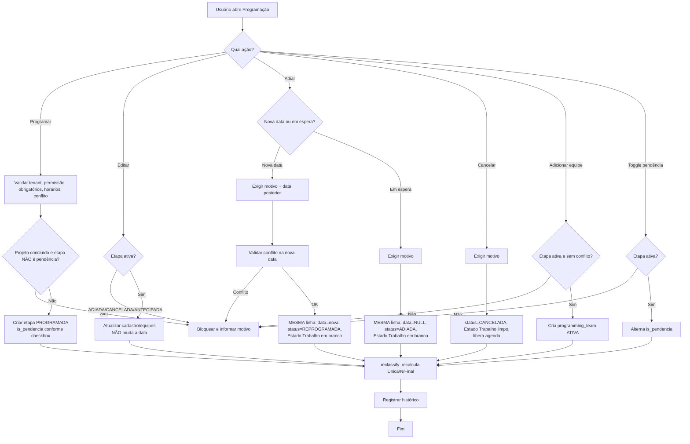
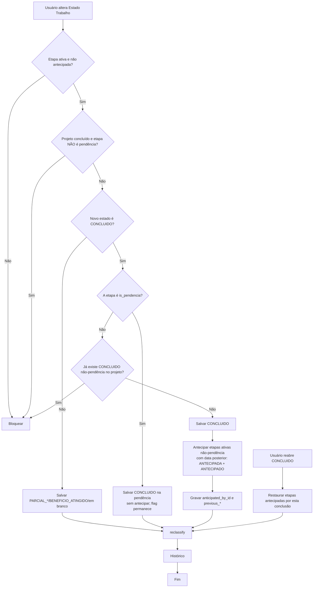

# Fluxograma de Regra de Negócio — Programação Normalizada

Reescrito em 2026-07-21 para o modelo NORMALIZADO (tela `Programação (Normalizada)`,
`/programacao-normalizada`, migrations 310–318). Supersede o fluxo anterior, que descrevia o
modelo legado (`programacao-simples`: `project_programming`, `programming_group_id`, ETAPA
digitada, copiar, reprogramar por edição). A tela legada mantém seu próprio fluxo.

Fonte de desenho: `docs/planejamento/Spec_Nova_Programacao_Modelo_Normalizado.md` e
`docs/planejamento/Mapa_Regras_Programacao.md`.

---

## 1. Camadas (três eixos independentes + a flag)

A etapa (`programming`) é o pai; as equipes (`programming_team`) são filhas.

### Eixo 1 — Status operacional (agenda da etapa)
* `PROGRAMADA`
* `REPROGRAMADA`
* `ADIADA` (inclui "em espera", sem data)
* `CANCELADA`
* `ANTECIPADA`

### Eixo 2 — Estado Trabalho (execução do serviço)
* em branco (a fazer)
* `PARCIAL_PLANEJADO`, `PARCIAL_NAO_PLANEJADO`, `BENEFICIO_ATINGIDO`
* `CONCLUIDO` (único que encerra o projeto)
* `ANTECIPADO` (automático)

### Eixo 3 — Participação da equipe (`programming_team.status`)
* `ATIVA`, `REMOVIDA`, `TRANSFERIDA`

### Flag ortogonal — `is_pendencia` (bool)
* Não é status nem Estado Trabalho. Quando `true`, a coluna Status exibe "Pendência"
  (vermelho) por cima do status de agenda; não afeta Etapa, Estado Trabalho nem numeração.

O Status informa o que aconteceu com a agenda. O Estado Trabalho informa a execução. A
classificação de etapa (`Única`/`N`/`Final`) é DERIVADA por data, nunca digitada.

---

## 2. Fluxo inicial comum a qualquer ação de escrita

**Início** → Usuário abre a tela → seleciona projeto e (conforme a ação) data, equipe,
horários, campos. O backend identifica a ação e valida, na RPC transacional com lock por
projeto:

→ Usuário tem permissão para a ação? Não → bloquear.
→ Projeto pertence ao tenant ativo? Não → bloquear.
→ Equipe/catálogos pertencem ao tenant ativo? Não → bloquear.
→ Projeto tem etapa `CONCLUIDO` ativa (não-pendência)?
  * Sim → bloquear inserir/editar/adicionar equipe/adiar/cancelar,
    **EXCETO** quando a etapa em questão é `is_pendencia` (criar/gerir pendência não exige
    reabrir o projeto).
  * Não → continuar.
→ A etapa alvo está em status editável para a ação? (ex.: só ativas recebem equipe/estado)
  * Não → bloquear.
→ Dados obrigatórios preenchidos? Não → bloquear e informar campos.
→ Horários válidos? Não → bloquear.
→ Existe conflito de agenda para a equipe/data/horário? Sim → bloquear (transacional, sem
  gravação parcial).
→ `expectedUpdatedAt` bate (registro não alterado por outro usuário)? Não → 409, pedir recarga.
→ Executa a ação → chama `reclassify_project_programming_stages` no final → grava histórico.

Não há validação de ETAPA digitada: a classificação é recalculada pelo sistema.

---

## 3. Ação: PROGRAMAR (criar etapa)

* Uma etapa por `(projeto, data)`. Campo obrigatório: `execution_date`.
* Checkbox **Pendência** no formulário "Nova etapa": cria a etapa já com `is_pendencia = true`
  — é o que ACIONA a exceção da trava de projeto concluído.
* Uma etapa por submissão. Datas adicionais entram por "Nova etapa a partir desta" (herda o
  cadastro, só a data fica em branco).
* Nasce `status = PROGRAMADA`, `work_completion_status` em branco.
* `reclassify` recalcula a classificação (1ª etapa → Única; a partir da 2ª a anterior deixa de
  ser Única; maior data → Final).

---

## 4. Ação: EDITAR (cadastro/equipes, NÃO a data)

* Edita descrição, horários, quantidades, documentos, atividades, equipes.
* **Não muda a data** (`DATE_CHANGE_NOT_ALLOWED`). Para remarcar, use Adiar.
* Editar campos operacionais **não** muda o status nem a classificação.
* `is_pendencia` não é editado por aqui — o card tem o toggle próprio.

---

## 5. Ação: ADIAR (in-place, duas rotas)

O editor comum mantém a data travada; remarcar é sempre pelo Adiar. A RPC atua IN-PLACE na
própria etapa (não cria linha nova).

### Rota "Nova data" (remarcar)
* Exige motivo e data posterior à atual (se a etapa tinha data). Checa conflito de agenda.
* Resultado: `execution_date = nova`, `status = REPROGRAMADA`, Estado Trabalho volta a branco.
* Dispara `reclassify` (a posição pode mudar).

### Rota "Deixar em espera" (sem data)
* Exige motivo. Resultado: `execution_date = NULL`, `status = ADIADA`, Estado Trabalho em branco.
* A etapa sai da numeração e não ocupa agenda (sem data). **Não aparece na lista cross-projeto**
  (filtrada por intervalo de data) — só no plano do projeto.

### Dar data a uma etapa em espera
* Aplicar Adiar > Nova data sobre uma etapa `ADIADA` sem data → `REPROGRAMADA` (volta à numeração).

A mudança de data De/Para vai para o histórico. Exceção da trava de concluído vale para etapa
`is_pendencia`.

---

## 6. Ação: CANCELAR

* Exige motivo. Marca `status = CANCELADA`, limpa Estado Trabalho, grava motivo/data/usuário.
* Aceita etapa ativa e em espera (`ADIADA`). Libera a agenda das equipes. Dispara `reclassify`.
* Exceção da trava de concluído para etapa `is_pendencia`.

---

## 7. Ação: ADICIONAR / REMOVER EQUIPE

* **Adicionar**: só em etapa ativa; equipe do tenant e ativa; não duplicada; sem conflito de
  agenda. Cria `programming_team` `ATIVA`. Não altera o status da etapa.
* **Remover**: marca a alocação `REMOVIDA`, libera a agenda. Remover a última deixa a etapa sem
  equipe (não cancela a etapa).
* Exceção da trava de concluído (adicionar) para etapa `is_pendencia`.

---

## 8. Ação: TOGGLE PENDÊNCIA (card)

* Liga/desliga `is_pendencia` de uma etapa existente e ativa
  (`set_project_programming_pendencia_flag`).
* Ligar exibe "Pendência" no Status; desligar volta ao status de agenda.
* **Desligar é bloqueado** (409) se o projeto tiver um CONCLUIDO ativo não-pendência — reabra a
  etapa concluída antes (migration 321). Evita trazer a etapa de volta como comum sem reabrir.
* Não toca Etapa, Estado Trabalho nem numeração.

---

## 9. Fluxo de Estado Trabalho

### Estado comum (parcial / benefício)
* `PARCIAL_PLANEJADO`, `PARCIAL_NAO_PLANEJADO`, `BENEFICIO_ATINGIDO` são manuais
  (`set_project_programming_work_completion_status`). Só em etapa ativa e não antecipada.
* `BENEFICIO_ATINGIDO` é informativo: não antecipa, não bloqueia, não encerra.
* Exceção da trava de concluído para etapa `is_pendencia`.

### Salvar CONCLUIDO (concluir)
* Só um `CONCLUIDO` **não-pendência** ativo por projeto.
* **Exige ao menos uma equipe ativa** (migration 322): planejamento pode ficar sem equipe, mas
  concluir não. No card, o botão Concluir fica desabilitado sem equipe.
* Marca `CONCLUIDO`; etapas ativas **não-pendência** com `execution_date` posterior viram
  `ANTECIPADA` + `ANTECIPADO`, guardando `previous_*`. A concluída vira a Final.
* **Concluir uma pendência** é permitido mesmo com o projeto já concluído: não antecipa nada, a
  flag `is_pendencia` fica (rastreio), `CONCLUIDO` prevalece na exibição.
* Não é possível remover a **última** equipe ativa de uma etapa concluída (reabra antes).

### Sair de CONCLUIDO (para parcial/em branco)
* Uma única RPC transacional `change_completed_stage_work_status` (migration 322): reabre,
  restaura as antecipadas e aplica o novo estado num só commit — nunca deixa o projeto reaberto
  sem o estado por falha entre duas chamadas.

### ANTECIPADO
* Nunca é escolhido à mão — é consequência automática do CONCLUIDO anterior (por data).

### Reabrir CONCLUIDO
* Restaura as etapas antecipadas por esta conclusão ao estado anterior e recalcula.

---

## 10. Matriz de decisão rápida

| Situação | Ação correta | Resultado principal |
| --- | --- | --- |
| Não existe etapa ainda | Programar | Cria `PROGRAMADA`; classificação recalculada |
| Voltar para matar uma sobra num projeto concluído | Programar com checkbox Pendência | Cria etapa `is_pendencia` sem reabrir o projeto |
| Ajuste de cadastro/equipes (sem data) | Editar | Atualiza a etapa; status/classificação inalterados |
| Empurrar a etapa para uma data futura | Adiar > Nova data | `REPROGRAMADA` (mesma linha), recalcula |
| Parar sem data definida | Adiar > Deixar em espera | `ADIADA` sem data, fora da numeração |
| Definir data de uma etapa em espera | Adiar > Nova data | Volta a `REPROGRAMADA` e à numeração |
| Serviço não acontecerá mais | Cancelar | `CANCELADA`, Estado Trabalho limpo |
| Incluir/retirar equipe | Adicionar/Remover equipe | Cria/`REMOVIDA` `programming_team` |
| Marcar/rastrear pendência | Toggle Pendência (card) | Alterna `is_pendencia` (só reflete no Status) |
| Serviço parcial | Estado Trabalho `PARCIAL_*`/`BENEFICIO_ATINGIDO` | Manual; não encerra |
| Serviço concluído | Concluir (`CONCLUIDO`) | Antecipa etapas futuras não-pendência |
| Concluir uma pendência | Concluir | `CONCLUIDO`, sem antecipar, flag fica |
| Etapa antecipada por conclusão anterior | `ANTECIPADO` automático | Não é manual |

Ações que NÃO existem neste modelo: Reprogramar por edição (a data fica travada no editor;
remarcar é via Adiar) e Copiar para datas (fora do escopo desta entrega).

---

## 11. Fluxograma — ações principais

## 12. Fluxograma — Estado Trabalho e conclusão

